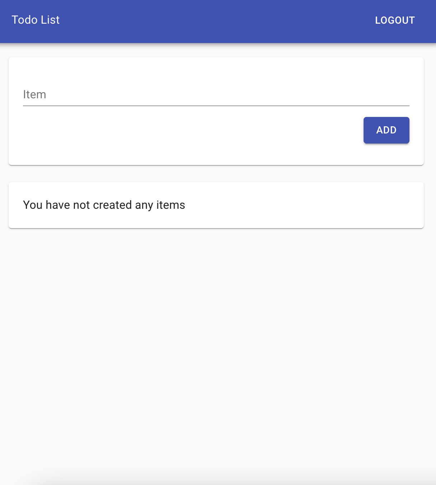
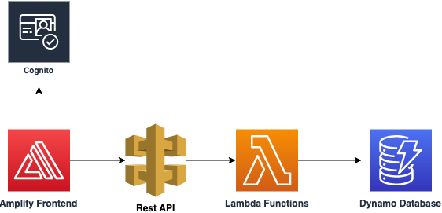

## Build a Simple Todo List using DynamoDb, API Gateway, Lambda and Amplify

In this demo, we are building an App that allows you to create a Todo list that can be accessed from the web. This app demonstrates commencting to a DynamoDB backned using API Gateway and Lambda functions




## Architecture 

The below diagram shows the architecture of the App - A react front-end utilizes AppSync graphql server to create, read, delete items to a DynamoDB database. We also have an integration with Amazon Rekognition which provides Computer Vision capabilities to detect objects in images that are used as labels to create the shopping list items. 



### Pre-requisites
1. Update nodejs to version 12. `nvm install 12.22`
2. CDK CLI ==> `npm install -g aws-cdk`
3. Amplify CLI ==> `npm install -g @aws-amplify/cli`
4. AWS Account

## Get Started by cloning the repo

`git clone https://github.com/sathishc/todolist`

## Install the necessary npm packages in the frontend

From the root of the project

```
npm install
```

Now you will have a frontend that includes just the React front-end. We are using React-Material-UI components to style the front-end. This is just boiler plate code without any backend integrations into AWS. In the repo, you fill find the file 'db.js' under src/api folder. We will add code here to integrate the frontend to backend services

Run `npm start` to see the UI frontend

## Setup the backend using the CDK

We will setup the backend which consists of lambda functions to add, list and delete todos, an api gateway, a dynamodb database and cognito user pool and identity pool using the CDK.

The Lambda functions are implemented in nodejs. To make sure the functions are ready to deploy you need to change directory into reach function directory and install the node modules

From the root of the directory run the following commands
```
cd backend

cd functions/addTodo
npm install
cd ../..

cd functions/getAllTodo
npm install
cd ../..

cd functions/deleteTodo
npm install
cd ../..

```

Now deploy the infrastructure.

```
cdk deploy -O ../src/cdk-exports.json
```

The above command will deploy the infrstructure and output necessary configuartion end points to the json file

## Initialize the front-end and add necessary libraries

**Initialize Amplify in the project from the root folder**

```
amplify init --y
``` 

to initialize the amplify project with default parameters and AWS default profile. Install Amplify javascript libraries needed from within the root folder of the repository

```
npm install --save aws-amplify @aws-amplify/ui-react
```

## Configure the App to use backend services

Open the file src/App.js and add the following to import the necessary components and configure the amplify app.

```jsx

import React, { useEffect, useState } from 'react';
import './App.css';

import { getUserItems, deleteItem, addItem } from './api/db'
import TableCard from './components/TableCard'
import NavBar from './components/NavBar'
import AddItemCard from './components/AddItemCard'
import { Grid } from '@material-ui/core'

// import Amplift and Hub
import { Amplify, Hub } from 'aws-amplify';
// Retrieve confirguation info from aws-exports and cdk-exports
import config from './aws-exports';
import { BackendStack } from "./cdk-exports.json"

// import the Authenticator and ui for react
import { Authenticator } from '@aws-amplify/ui-react';
import '@aws-amplify/ui-react/styles.css';

// setup configurations
const cdkConfig = {
  API: {
    endpoints: [
      {
        name: BackendStack.apiname,
        endpoint: BackendStack.apiendpoint
      }
    ]
  }, 
  aws_cognito_region: BackendStack.awscognitoregion,
  aws_user_pools_id:  BackendStack.userpool,
  aws_user_pools_web_client_id: BackendStack.webclientid,
  aws_cognito_identity_pool_id: BackendStack.identitypool,
}

Amplify.configure(config);
Amplify.configure(cdkConfig);

function App() {

  const [items, setItems] = useState([])

  useEffect(() => {
    fetchData()

  }, [])

  async function fetchData() {
    setItems(await getUserItems())
  }
  
  // use the Hub to remspond toe events
  Hub.listen('auth', (data) => {
    if (data.payload.event === 'signIn') {
      fetchData()
    } else if (data.payload.event === 'signOut') {
      window.location.reload();
    }
  });

  return (
    // Wrap the code with authenticator, emnable email as an additional attribute
    <Authenticator signUpAttributes={[
      'email',
    ]}>
    {() => (  
    <div className="app">
      <NavBar/>
      
      <div className="content">
        <Grid container spacing={3}>
        
            <AddItemCard 
              addAction = {
                async (itemName) => {
                  const response = await addItem(itemName)
                  
                  if (response){
                    setItems([...items, response])  
                  }
                }
              }     
            />
            
           <TableCard 
              data={items}
              removeAction={async (id)=>{
                const response = await deleteItem(id)
                if (response) {
                  setItems(items.filter(item => item.id !== id))  
                }
              }}
            />
        </Grid>
      </div>
    </div>
    )}
    </Authenticator>
  );
}

export default App;
```
Refreshing the browser should show up a login and signup screen. SIgnup using your username/password and email.

Hub is a lightweight implementation of Publisher-Subscriber pattern, and is used to share data between modules and components in your app. Here we are using it to fetch backend data whenever a new sign-in occurs.

Enable sign out functionality in `src/components/Navbar.js` by un-commenting relevant code. We will be doing it by importing the Auth module `import { Auth } from 'aws-amplify';` and then adding `await Auth.signOut();` on click of the logout button.

## Integrate the App with the backend through API Gateway

Open the file src/api/db.js and add the following to import the necessary code to integrate with the backend

```javascript
import { API, Auth } from 'aws-amplify'

const apiName = 'todolist-todoApi';
const todosPath = '/todos'; 

// This function is called immediately when the page loads, before populating the table with this data
export async function getUserItems() {
    const myInit = { 
        headers: { 
            Authorization: `Bearer ${(await Auth.currentSession()).getIdToken().getJwtToken()}`,
        },
    };

    const todos = await API.get(apiName, todosPath, myInit);
    console.log("Todos ", todos);
    return todos.Items;
}

// This function is called when a user clicks the button 'Add'
export async function addItem(itemName) {
    const myInit = { 
        headers: { 
            Authorization: `Bearer ${(await Auth.currentSession()).getIdToken().getJwtToken()}`,
        },
        body: {  
            "name": itemName,
        },
    };

    const todo = await API.post(apiName, todosPath, myInit)
    return todo.Item;
}

// This function is called when a user deletes an existing item in the table
export async function deleteItem(itemId) {
    const myInit = { 
        headers: { 
            Authorization: `Bearer ${(await Auth.currentSession()).getIdToken().getJwtToken()}`,
        }
    };

    const todo = await API.del(apiName, todosPath + "/" + itemId, myInit)
    return itemId;
}
```

 ## Add Hosting

 Until now we have just provisioned backend and connected from a local front-end. Now we will host the front-end using Amplify.

 From the project root, run the command `amplify add hosting` and follow the steps

 ```
 Select Hosting with Amplify Console
 Choose a type Manual deployment
 ```

 After providing the options type `amplify publish`. This step packages the front end and deploys the necessary binaries into a hosted Amplify frontend. The output of this command will be the url where the App is hosted on AWS.

## Cleanup

Cleanup the App frontend by running `amplify delete` from the project root.

To delete the backend services, run the following
```
cd backend
cdk destroy
```

Have fun and build on !

## Security

See [CONTRIBUTING](CONTRIBUTING.md#security-issue-notifications) for more information.

## License

This sample is licensed under the MIT-0 License. See the LICENSE file.
